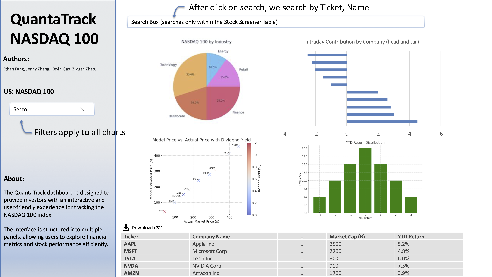

# QuantaTrack Proposal

## 1. Motivation and purpose

The financial markets are evolving rapidly, and investors face the challenge of making informed decisions amid a sea of complex data. QuantaTrack was developed to address this need, providing a user-friendly dashboard designed for tracking and analyzing the NASDAQ100. The platform aims to simplify market analysis by offering investors access to key performance metrics and trends, all in one place. QuantaTrack’s purpose is to streamline complex data and make it actionable, helping users stay informed and confident in their investment decisions.

QuantaTrack is built to serve both seasoned investors and those new to the market, providing a straightforward interface for monitoring market shifts, spotting emerging trends, and assessing stock performance. By combining advanced analytics with easy-to-understand visuals, QuantaTrack helps users track their portfolio, anticipate market movements, and adapt their strategies in real-time. In an environment where quick, informed decisions are critical, QuantaTrack aims to be the go-to platform for investors seeking reliable insights on the NASDAQ100.

## 2. Description of the data

The dataset used for this project is derived from the NASDAQ 100 Companies and includes key financial metrics for each company in the index. 

It contains several variables crucial for analyzing the stock performance of the companies listed, 

- Basic Information (`Ticker`, `Name`, `Sector`)

- Stock Performance and Price (`Price`, `IntradayReturn`, `YTDReturn`, `IntradayContribution`, `YTDContribution`)

- Valuation Metrics (`PE`, `PB`, `Dividend Yield`, `Dividend`, `Profit_TTM`)

- Market Data (`Volume`, `Amount` ,`MarketCap`, `SharesOutstanding`, `Weight`)

- Time (`Date`)

We plan to visualize market trends and compare sector-wise contributions to the overall performance. 

Additionally, we will derive new variables such as (`market_trend_patterns`) and (`correlation_between_sector_performance`) and (`overall_returns`) to understand the broader market shifts.

This analysis will assist in identifying patterns and understanding market dynamics, particularly focusing on sector performance and individual stock behavior within the NASDAQ 100 index.

## 3. Research questions

John is an investment analyst at a hedge fund, tasked with evaluating the performance of large-cap stocks, particularly those in major indices such as the NASDAQ 100. He logs into the QuantaTrack app, which provides an interactive dashboard for visualizing the performance of companies within the NASDAQ 100 index. John’s goal is to explore the performance metrics of various companies in the index, understand their contribution to market movements, and identify key stocks that may drive future market trends.

As John navigates the dashboard, he starts by filtering the data to focus on the Information Technology sector, which has a significant representation in the NASDAQ 100. He examines key metrics such as market cap, PE ratio, intraday return, and YTD return. By sorting the data, John quickly identifies that Apple Inc and Microsoft Corp dominate the index in terms of market cap and weight. These two companies have a major influence on the overall market movement, and their stock price fluctuations are highly correlated with the performance of the NASDAQ 100.

Next, John dives deeper into the intraday return metric and notices that Tesla Inc is seeing strong performance for the day, with a high intraday return compared to other stocks. This prompts him to investigate further, and he speculates that Tesla’s stock is likely reacting to a positive news cycle or a market event. By analyzing these metrics and comparing them across companies, John concludes that Apple and Microsoft will continue to drive the index’s performance, while Tesla may offer shorter-term opportunities for growth. Based on these insights, John recommends an increased allocation of the fund’s capital into Apple and Microsoft, while keeping an eye on Tesla for potential adjustments.

## 4. App sketch and description

### App Sketch

### Description

The QuantaTrack dashboard is designed to provide investors with an interactive and user-friendly experience for tracking the NASDAQ 100 index. The interface is structured into multiple panels, allowing users to explore financial metrics and stock performance efficiently.

- **Filters & Controls Panel:** This section enables users to refine their analysis by filtering companies based on sector, selecting a specific index (NASDAQ 100 or S&P 500), and searching for companies by ticker or name. These tools ensure that users can easily focus on relevant data.

- **NASDAQ 100 by Industry (Pie Chart):** This visualization represents the sectoral composition of the NASDAQ 100, helping users understand the weight of different industries in the index.

- **Intraday Contribution by Company (Bar Chart - Horizontal):** This chart highlights the top and bottom companies in terms of intraday performance, allowing users to quickly identify the biggest market movers.

- **Model Price vs. Actual Price with Dividend Yield (Scatter Plot):** This visualization compares the actual market price of stocks to their estimated model prices, with the dividend yield represented as a color gradient. This helps investors identify potentially overvalued or undervalued stocks.

- **YTD Return Distribution (Histogram):** This plot shows the year-to-date return distribution of NASDAQ 100 stocks, helping users assess market trends and overall performance.

- **Stock Screener Table:** The table provides a structured, sortable, and searchable view of key financial data for NASDAQ 100 companies, including market cap and YTD return. Users can quickly identify trends and compare different stocks based on their financial metrics.

Users will interact with the dashboard by applying filters, hovering over data points for detailed insights, and dynamically updating the visualizations to explore trends and market shifts. The combination of structured data tables and interactive charts ensures that investors can make data-driven decisions efficiently. The design follows best practices for financial data visualization, keeping complexity manageable while ensuring that all key insights are easily accessible.